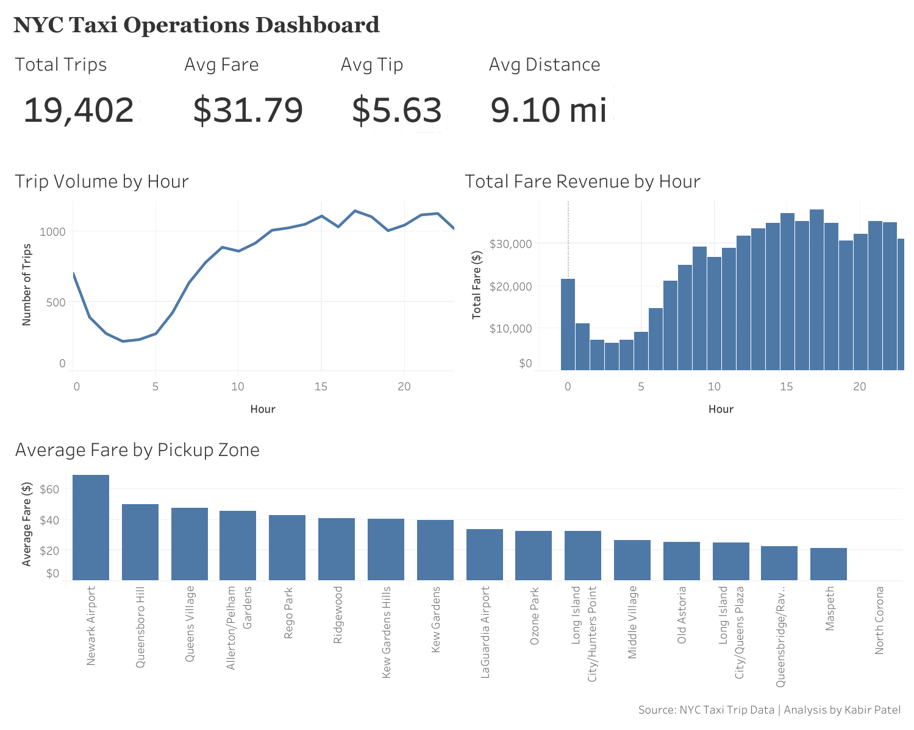

# NYC Taxi Operations Dashboard
**Tableau | Data Visualisation | Business Intelligence | Dashboard Design**

---

## Executive Summary

An interactive Tableau dashboard built on 19,402 cleaned NYC taxi trips, designed to give fleet operations managers a clear, at a glance view of revenue patterns, peak demand periods, and zone level performance.

Key findings surfaced by the dashboard:
- **Newark Airport is the highest average fare zone at $67**, nearly double the dataset average of $31.79
- **Trip volume and revenue both peak between 3pm and 11pm**, with a clear morning commute spike from 7am to 9am
- **Average tip of $5.63 on a $31.79 fare** represents an 18% tip rate, indicating strong customer satisfaction on higher value trips
- **Average trip distance of 9.10 miles** confirms the dataset is dominated by longer cross borough and airport routes rather than short inner city rides

---

## Business Problem

Fleet operations managers need a fast, accessible way to understand where and when revenue is being generated, without digging through raw data. A well designed dashboard turns thousands of trip records into clear, actionable signals.

***Which pickup zones and time windows drive the most revenue, and how should a fleet operations team schedule drivers to maximise productivity?***

**Primary stakeholder:** Fleet operations managers and revenue analysts who need daily visibility into trip performance, zone revenue, and demand patterns to make scheduling and routing decisions.

---

## Dashboard

**View the interactive dashboard here:**
[NYC Taxi Operations Dashboard on Tableau Public](https://public.tableau.com/views/NYCTaxiOperationsDashboard/Dashboard1)

*Interactive dashboard showing KPI cards, trip volume by hour, total fare revenue by hour, and average fare by pickup zone.*

---

## Dashboard Design

The dashboard is structured in three layers:

**Top — KPI Cards**
Four headline metrics give an instant summary of the dataset: total trips, average fare, average tip, and average trip distance. These allow a manager to assess overall fleet performance at a glance before diving into the charts.

**Middle — Demand & Revenue by Hour**
Two side by side charts show trip volume (line) and total fare revenue (bar) across all 24 hours. Viewing both together reveals not just when trips peak, but when revenue peaks, the two don't always align perfectly.

**Bottom — Average Fare by Pickup Zone**
A sorted bar chart showing average fare by named pickup zone, from Newark Airport ($67) down to North Corona ($20). This directly answers the question of which zones are most valuable per trip for driver positioning.

---

## Skills

**Tableau:**
- Connecting and loading CSV data sources
- Building line charts, bar charts, and KPI text cards
- Aggregating measures (SUM, AVG, COUNT) and switching between them
- Sorting charts by measure value (descending)
- Formatting axes, number formats, currency, and custom suffixes
- Dashboard layout design with floating and tiled containers
- Publishing to Tableau Public with a shareable link

**Data preparation (Python/Pandas):**
- Cleaned raw taxi trip data (removing nulls, negative values, zero distances)
- Parsed DateTime fields and extracted hour features
- Merged trip data with JSON zone lookup to replace location IDs with readable zone names
- Exported cleaned and merged dataset for Tableau ingestion

---

## Key Findings & Recommendations

**1. Prioritise airport zone positioning**
Newark Airport has the highest average fare in the dataset at $67, more than double the average. LaGuardia Airport also performs above average. Positioning drivers near these zones during inbound flight windows offers the most reliable high value trips.

**2. Maximise evening fleet availability**
Both trip volume and total fare revenue peak between 3pm and 11pm. This is the highest value scheduling window and should have the highest driver availability. The 3am to 5am window is consistently the lowest, and reducing overnight deployment would improve fleet efficiency.

**3. Morning commute is the secondary priority**
A clear secondary peak appears from 7am to 9am. Morning shifts starting at 6:30am would capture this demand window fully.

**4. Short inner city zones are lower value**
Zones like North Corona ($20 average fare) and Maspeth ($22) generate significantly less revenue per trip. Drivers in these zones should be encouraged to reposition toward higher-value zones between trips rather than waiting for local demand.

---

## Next Steps & Limitations

**Limitations:**
- The zone lookup covers only 25 of the 265 NYC TLC zones, so the zone chart reflects a subset of all pickups rather than the full geographic picture
- The dataset is a sample of trips rather than a full operational period, limiting seasonal and day of week analysis
- No driver level data is available, so individual driver productivity and utilisation cannot be measured

**If I had more time / data:**
- Connect the full 265 zone NYC TLC lookup to enable borough-level analysis across all five boroughs
- Add a day of week filter so managers can compare weekday vs weekend demand patterns
- Build a map visualisation showing revenue intensity by zone geographically
- Add a payment type breakdown to understand cash vs card vs app split by zone

**Tableau Public link:** https://public.tableau.com/views/NYCTaxiOperationsDashboard/Dashboard1

---

*This dashboard extends the exploratory data analysis conducted in the [NYC Taxi Data Analysis](https://github.com/kabirpatel1/nyc-taxi-data-analysis) Python project, translating the same dataset into an interactive business intelligence tool.*
